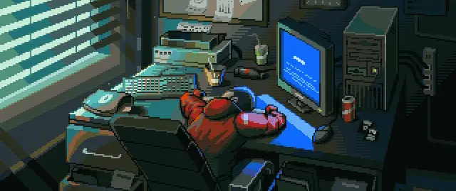

  

<h1 align="center">👋 Hi, I'm Atharv Joshi</h1>

<h3 align="center">
Full Stack Web Developer
</h3>

  

---

## 🚀 About Me

- 🌱 Currently exploring Backend Development & Open Source
- 💻 Building projects with MERN Stack
- ⚡ Interested in AI, DevOps, and System Design
- 📚 Learning something new every day
- 🎯 Goal: Create impactful products and grow as a developer

---

## 🛠️ Tech Stack

### 🌐 Web Development

  

### 💻 Programming Languages

  

### ⚙️ Tools & Platforms

  

---

## 📊 GitHub Stats

  

  

